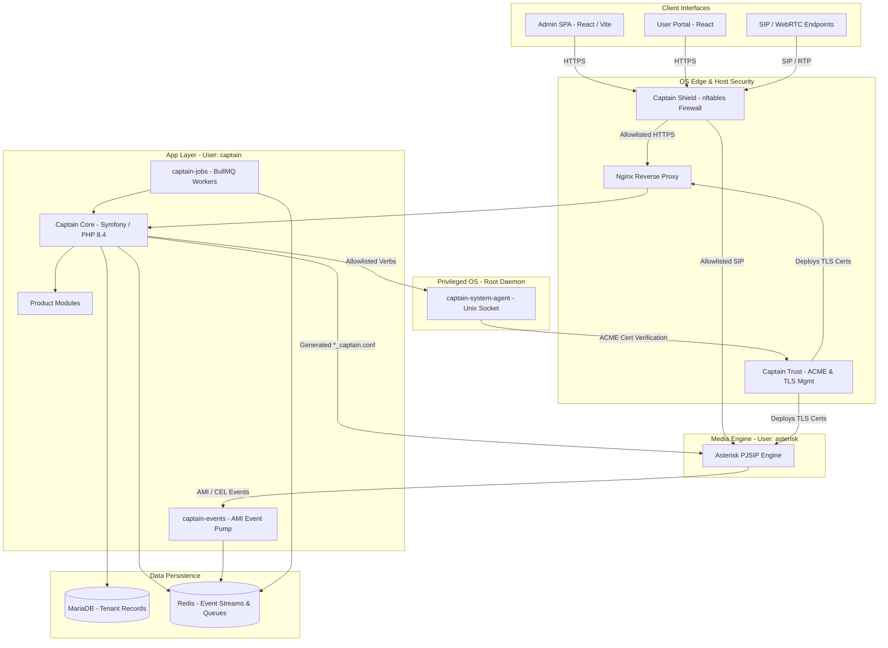
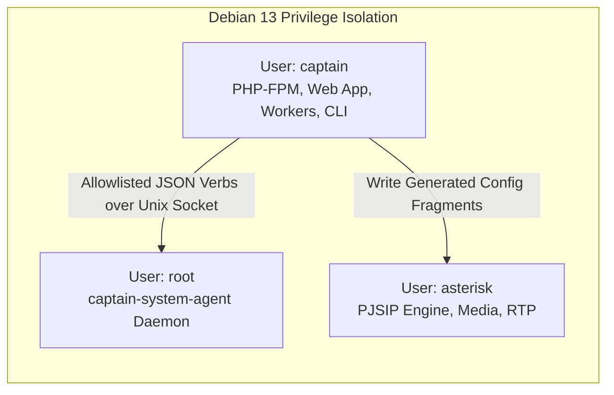
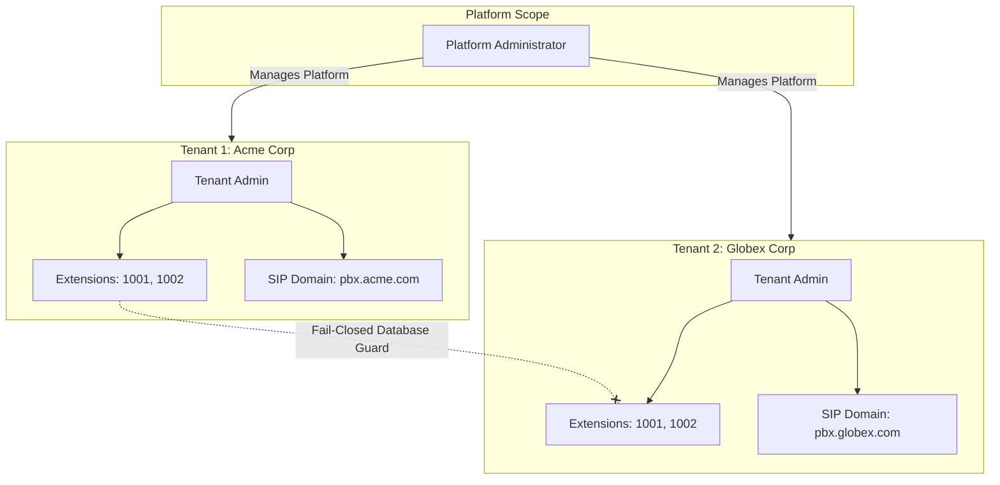
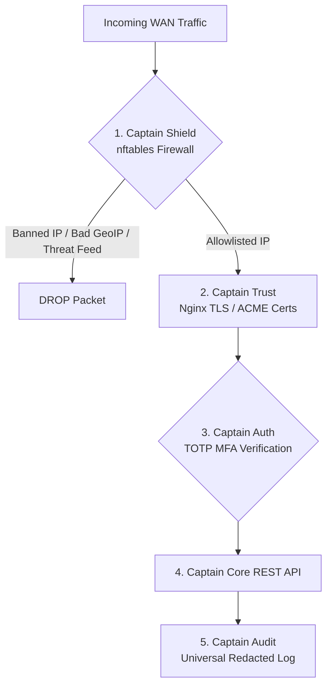
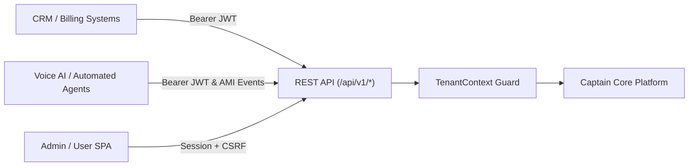
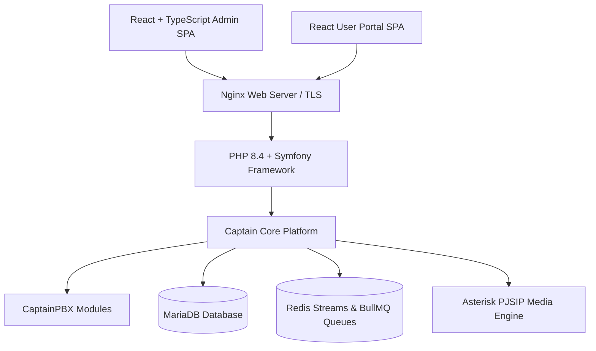

# CaptainPBX — Next-Generation Voice PBX

> **CaptainPBX** is a modern, security-first telecommunications control plane and Debian-based appliance that treats voice communication as a software product—decoupling business logic, web APIs, and system administration from media execution.

---

## 📌 Why CaptainPBX?

Classic open-source PBX platforms were traditionally built by placing a web GUI on top of raw configuration files (`extensions.conf`, `pjsip.conf`). This legacy model led to security risks (web processes running as `root`), brittle multi-tenancy hacks, and difficult API integration.

**CaptainPBX completely inverts this model:**

1. **Domain Logic Lives in Code**: `User`, `Identity`, `Tenant`, `Extension`, and `Device` are distinct entities with explicit database joins—not squeezed into Asterisk files.
2. **Asterisk is Strictly Media**: The Asterisk engine only handles SIP and RTP. Captain Core compiles and injects generated configuration fragments (`*_captain.conf`). PHP never edits `/etc/asterisk` directly.
3. **The OS is an Allowlist**: Operating system privileges are isolated. Application workers run as an unprivileged `captain` user, while privileged system changes go through a lightweight, allowlisted Unix socket daemon (`captain-system-agent`).
4. **API-First & Automation Ready**: Everything in the UI is backed by versioned `/api/v1` REST endpoints with OpenAPI specs, making CaptainPBX natively ready for **Voice AI agents, CRM integration, and billing automation**.

### What "Game Changer" Actually Means (Boundaries over Slogans)
* **Fail-Closed Tenancy**: `tenant_id` from the browser is never trusted; server-side resolution is mandatory.
* **Default-Deny & GeoIP Security**: Captain Shield (`nftables`) enforces default-deny host security with GeoIP country filtering and dynamic IDS bans, keeping core databases and media interfaces completely dark to the public WAN.
* **Universal Redacted Audit**: Platform-wide audit hooks capture every UI CRUD operation (Admin SPA & User Portal), authentication attempt, and database write while automatically redacting passwords, API tokens, and SIP secrets.
* **Captain Insights & Multi-Domain Reporting**: Real-time operational dashboards and specialized analytics across Queues (27 report categories), IVR navigation, Conference rooms, and Call Policies with instant CSV, PDF, and JSON exports.
* **Automated PHPUnit QA**: Enterprise regression testing framework built into  and module trees ensuring domain isolation, API integrity, and Asterisk config compilation.
* **Dedicated User Portal**: Independent React SPA workspace giving extension owners self-service access to voicemail, call recordings, directories, and MFA security without admin privileges.
* **Identity Port**: Local logins and TOTP today; OIDC/SAML/LDAP can attach without rewriting user entities.
* **Privilege Split**: `captain` (application) · `asterisk` (media engine) · `root` (only inside `captain-system-agent`).
* **Isolated Event Lanes**: CDR/CEL, queue facts, and BLF presence do not share one Redis firehose.
* **Non-Blocking Parallel Jobs**: Scheduler enqueues jobs; BullMQ workers execute PHP processes in parallel.

---

## 🏢 Who Is CaptainPBX For?

| Audience | Key Benefits & Value Proposition |
| :--- | :--- |
| **Developers & Voice AI Builders** | Versioned `/api/v1` REST APIs, OpenAPI `/api/docs` specs, JWT bearer tokens, Redis event streams, BullMQ queues, and destination objects for AI call handling. |
| **MSPs & Hosted Operators** | True fail-closed multi-tenancy, custom FQDN `sip_domains`, tenant-scoped API tokens, and shared engine efficiency. |
| **Security-Conscious Teams** | Default-deny `nftables` host firewall, GeoIP filtering, dynamic IDS ban rules, mandatory TOTP MFA, and immutable redacted audit logging. |
| **Contact Centers, Operators & Support Teams** | Captain Insights suite: Real-time system/call dashboards, 27 queue report categories, IVR menu analytics, Conference room usage, Call Policy compliance, and instant CSV/PDF/JSON exports. |
| **Open Source Community** | Modern stack (Symfony PHP 8.4, React, MariaDB, Redis) on Debian 13—easy to extend, maintain, and contribute without legacy framework constraints. |

---

## 🏗️ System Architecture Overview

CaptainPBX uses a **four-tier privilege split** to separate administrative HTTP traffic, background jobs, system privileges, and voice media.

---

## 1. Operating System & Non-Root Architecture (Debian 13)

The CaptainPBX ISO runs on **Debian 13 (Trixie)**. The core security model rests on strict system user privilege separation to ensure that a web vulnerability cannot compromise the operating system.

### User Privilege Split Rules

| User Account | Execution Responsibilities | Security Restrictions & Must NOT Do |
| :--- | :--- | :--- |
| **`captain`** | PHP-FPM pool, CLI tasks, BullMQ job workers, `captain-events` ingest pump | `shell_exec`, `passthru`, `exec`, and `system` are disabled in `php.ini`. Cannot edit `/etc/asterisk` or invoke raw `sudo`. |
| **`asterisk`** | PJSIP channel engine, RTP audio handling, dialplan execution | Isolated from MariaDB administrative tables, web sessions, and system configuration. |
| **`root`** | Runs only the `captain-system-agent` daemon listening on a local Unix socket | Accepts only named, allowlisted JSON verbs (`firewall.apply`, `acme.renew`, `timezone.set`). Accepts no arbitrary shell strings. |

---

## 2. Fail-Closed Multi-Tenant Isolation

Multi-tenancy in CaptainPBX is enforced at the database repository level using a **fail-closed model**. Every tenant-owned database table carries a mandatory `tenant_id`.

### Multi-Tenant Guarantees

* **Server-Side Tenant Context**: Client browsers cannot inject or forge `tenant_id`. The tenant scope (`TenantContext`) is validated server-side during request authentication.
* **Overlapping Extension Numbers**: Extension numbers are unique within a tenant. Tenant 1 and Tenant 2 can both assign extension `1001` without conflict.
* **Custom SIP Domains**: Each tenant registers against its custom FQDN (`sip_domain`), isolating registration traffic on shared Asterisk infrastructure.
* **Tenant-Scoped API Tokens**: REST API tokens are bound to a specific tenant ID at mint time and cannot hop across tenants.
* **Isolated Media Files**: Recordings, voicemail, and MOH audio files are stored in tenant-isolated paths.

---

## 3. Security Architecture: Captain Shield (nftables) , Captain Auth (MFA) and Captain Trust

CaptainPBX treats host defense, identity authentication, certificate management, and auditing as core built-in products.

### A. Captain Shield (Host Protection & Firewall)
* **Default Deny**: Administrative paths (HTTPS 443, SSH 22) and SIP signaling (5060/5061) are locked by default until explicitly allowlisted by IP, CIDR, or FQDN.
* **Always Dark on WAN**: Internal infrastructure services (AMI 5038, ARI, MariaDB 3306, Redis 6379) are strictly bound to internal interfaces and have no UI toggle to expose them to the WAN.
* **Intrusion Detection System (IDS)**: Automatically detects web login failures, SIP REGISTER/auth failures, or SSH attempts and applies temporary/permanent bans.
* **GeoIP Filtering**: Restricts Admin and SIP access by country using DB-IP Lite on the appliance.
* **Community Threat Feeds**: Integrated with community-driven threat intelligence feeds to block known scanners while preserving local allowlists.
* **Emergency Rules**: Console-based panic open/lockdown and self-ban prevention.

### B. Captain Auth (Multi-Factor Authentication)
* **Native TOTP MFA**: Supports authenticator apps (Google Authenticator, Authy) and single-use emergency backup codes for web identities (Admin SPA & User Portal).
* **Configurable Enforcement Policy**:
  * **Off**: Password-only authentication.
  * **Optional**: Users may enroll TOTP voluntarily.
  * **Required**: Forces MFA enrollment before allowing portal or admin access.
* **Tenant Policy Control**: Platform admins enforce MFA policies per tenant.

### C. Captain Trust (Automated TLS & Certificates)
* **TLS Management**: Platform-wide inventory for self-signed certificates, custom PEM uploads, and automated **ACME HTTP-01 renewals** (Let's Encrypt).
* **Automated Deployment**: Automatically deploys certificates to Nginx and Asterisk PJSIP via `captain-system-agent`.

### D. Captain Audit (Universal Redacted Trail)
* **Universal Operations Audit**: Captures every UI CRUD operation (Create, Read/View, Update, Delete across Admin SPA & User Portal), administrative change, authentication event (sign-in/sign-out), and database write.
* **Platform-Level Repository Hook**: Intercepts state changes inside Captain Core Records before persistence—ensuring audit logging cannot be bypassed by controllers or background scripts.
* **Automatic Secret Redaction**: Automatically sanitizes sensitive data, replacing raw passwords, SIP credentials, and API tokens with `[redacted]` before entries are written.
* **Tenant & Appliance Scoped**: Audit events preserve tenant isolation context, allowing tenant admins to review their own operational trail while platform admins maintain full appliance-wide audit visibility.

### E. Captain Bridge (OS Agent)
* Exposes safe system administration (timezones, IPv4 configuration, hostnames, system updates) via allowlisted JSON verbs sent to `captain-system-agent`.

---

## 4. Developer-Friendly OpenAPI & Integration

Everything accessible in the Admin SPA or User Portal is backed by a clean, versioned REST API catalog designed for integrators and Voice AI developers.

### Integration Capabilities

* **OpenAPI Documentation**: Interactive documentation available at `/api/docs` and per-module OpenAPI definitions at `/api/docs/{moduleId}`.
* **Versioned JSON Endpoints**: Clean `/api/v1/` endpoints for managing extensions, users, queues, IVRs, and destinations.
* **JWT & API Tokens**: Support for short-lived JWT access tokens and granular, long-lived API tokens with resource-level permissions (Read/Write/Admin).
* **Real-time Event Streams**: Asterisk AMI events broadcast over Redis Streams for live call monitoring, CRM screen pops, and speech analytics integration.

---

## 5. Automated Testing & Quality Assurance (PHPUnit)

CaptainPBX enforces continuous quality assurance through a native PHPUnit testing architecture embedded directly within  and individual product modules ().

### Key Testing Capabilities

* **Comprehensive Module Coverage**: Every product module owns unit and integration test suites covering controller endpoints, DBAL/ORM repository queries, and event listeners.
* **Tenant Isolation Verification**: Programmatically verifies fail-closed  guards to prevent cross-tenant data leaks or unauthorized relationship joins.
* **Domain & Entity Rules**: Validates explicit entity relationships (, , , ) and role permissions.
* **Configuration Compiler Validation**: Unit tests execute the Asterisk config compiler against mock tenant states, verifying generated  file syntax before deployment.
* **CI/CD Pipeline Ready**: Integrates seamlessly with continuous integration pipelines for automated regression testing on every pull request or appliance build.

---

## 6. Software Stack & Architecture Components

CaptainPBX uses modern, enterprise-proven software skills with Light and Dark theme user experience options across all interfaces.

| Technology | Architectural Role | Value Proposition |
| :--- | :--- | :--- |
| **PHP 8.4 / Symfony** | HTTP Kernel, Routing, Dependency Injection, Console | Enterprise framework stability; no homegrown PHP framework hacks. |
| **React + TypeScript + Vite** | Admin SPA & User Portal | Fast, modular UI components with built-in Light & Dark theme support. |
| **MariaDB** | Product Data Source of Truth | Relational integrity with fail-closed tenant queries. |
| **Redis** | Async Queues & Event Streams | Handles BullMQ background jobs, presence BLF, and AMI streams without touching SQL hot paths. |
| **Asterisk (PJSIP)** | Telephony Media Engine | Dedicated strictly to SIP signaling, RTP bridging, and dialplan execution. |
| **Debian 13 (Trixie)** | Appliance Operating System | Stable, long-term support Linux foundation. |

---

## 7. Captain Insights: Real-Time Operational & Multi-Domain Reporting

CaptainPBX features an independent, comprehensive reporting engine—**Captain Insights**—that transforms raw telephony event streams into actionable operational data without impacting live call processing.

### A. Real-Time Operational Dashboards & System Metrics
* **Live System Monitoring**: Real-time visibility into active call channels, concurrent call peaks, SIP endpoint registration states, trunk utilization, CPU/Memory health, and  heartbeats.
* **Asynchronous Queue & Worker Health**: Live tracking of BullMQ background job queues, worker slot occupancy, and execution throughput.
* **Proactive Operational Alerting**: Instant UI notifications for queue capacity breaches, trunk gateway degradation, and system load spikes.

### B. Modern Queue Analytics (27 Report Categories)
* **Comprehensive Queue Performance**: 27 dedicated reporting categories covering queue operations (performance, abandoned calls, overflow trends, peak hours), call detail records, SLA/ASA (Average Speed of Answer) calculations, and agent scorecards (missed rings, pause reasons).
* **Short Hangup Exclusions**: Automatically filters out brief calls (default < 5 seconds) to prevent abandoned call rate distortion and protect SLA accuracy.
* **Agent & Outlier Analysis**: Pinpoints handle-time outliers, agent availability trends, and queue distribution heatmaps across weekdays and hours.

### C. IVR Navigation Analytics & Keypress Heatmaps
* **Menu Traversal Analysis**: Detailed tracking of caller journeys through nested IVR trees, identifying primary call drivers and menu flow efficiency.
* **Keypress Heatmaps & Exit Points**: Visual breakdowns of option selections, invalid keypress frequency, caller drop-off points, and menu timeout events.
* **Return-to-IVR & Loop Detection**: Detects callers looping back through menus, enabling operators to optimize IVR menu prompts and routing rules.

### D. Conference Room Analytics
* **Conference Room Utilization**: Tracks active conference room concurrency, duration, and bridge occupancy trends across tenants.
* **Participant & Speaker Statistics**: Reports on participant count, join/leave timestamps, individual talk time, and active speaker statistics.
* **Bridge Quality & Capacity**: Monitors bridge resource allocation to prevent audio degradation during large conference sessions.

### E. Call Policy & Security Compliance Reporting
* **Outbound Route & DID Usage**: Monitors outbound route selection, trunk distribution, DID utilization, and carrier cost optimization.
* **Blocked & Policy Violation Logging**: Audits unauthorized destination call attempts, toll-fraud prevention blocks, rate-limit triggers, and restricted number attempts.
* **Emergency Call Alerts**: Immediate logging and notification of emergency service dialing across all tenants.

### F. Multi-Format Export & API Integration
* **Instant File Exports**: One-click generation of **CSV**, **JSON**, and publication-ready **PDF reports**.
* **REST API Access**: Every report is accessible programmatically via versioned  endpoints for seamless integration with external Business Intelligence (BI) tools and custom dashboards.

---

## 8. Modern Visual IVR Builder & Unified Destination Engine

CaptainPBX features a modern IVR creation canvas backed by a unified destination routing architecture.

### Key Capabilities

* **Dual Interface**: Supports both a **Visual Canvas Graph** and a **Form-Based Editor** operating on a single unified graph model.
* **Flexible Step Actions**: Configurable step nodes including Play Audio, Collect Keypress, Route to Destination (Queue, Voicemail, Extension, Sub-IVR), and Hang Up.
* **Timeout & Retry Handling**: Customizable retry limits, invalid option fallbacks, Music on Hold (MOH) selections, and direct extension dialing toggles.
* **Unified Destination Catalog**: All IVR menus, inbound DID routes, ring groups, and feature codes direct traffic through a single, consistent destination routing engine.

---

## 9. User Portal & Self-Service Workspace

The **User Portal** is an independent React Single Page Application (SPA) designed to empower extension owners, desk staff, and contact center agents with self-service capabilities without exposing system or tenant administration settings.

### User Portal Features

* **Voicemail & Call Recording Management**: Listen, download, archive, or delete personal voicemail messages and recorded calls directly in the browser.
* **Directory & Personal Phonebooks**: Instant search across corporate directories, personal contacts, favorites, and team extension rosters.
* **Device & Key Configuration**: Inspect assigned SIP endpoints, WebRTC softphones, line appearances, and programmable BLF desk phone keys.
* **Self-Service Security**: Inbuilt enrollment wizard for  TOTP multi-factor authentication and emergency backup code management.
* **Call Rules & Forwarding**: Set personal call forwarding, do-not-disturb (DND) status, and custom ring duration preferences.

---

## 🔄 Traditional Telephony Stacks vs. CaptainPBX Comparison Matrix

| Feature / Dimension | Traditional Telephony Stack | CaptainPBX Modern Control Plane |
| :--- | :--- | :--- |
| **Core Architecture** | Web GUI wrapper over Asterisk configuration files | Decoupled control plane built on Symfony, React, & MariaDB |
| **System Security** | Web server frequently runs as `root` with `sudo` access | Strict non-root `captain` user with allowlisted `captain-system-agent` |
| **Host Defense** | Manual iptables scripts or third-party add-ons | Native `nftables` firewall (Captain Shield) with GeoIP & IDS |
| **Multi-Tenancy** | Requires separate server instances or virtual machines | Enforced fail-closed multi-tenancy on a shared media engine |
| **API & Automation** | Custom PHP scripts or unversioned endpoints | Fully versioned `/api/v1` REST catalog with OpenAPI specifications |
| **Authentication** | Basic password authentication | Native TOTP Multi-Factor Authentication (Captain Auth) |
| **Certificate Management**| Manual Certbot command-line execution | Automated ACME HTTP-01 management (Captain Trust) in web UI |
| **Automated Testing & QA** | Manual or ad-hoc test scripts | Inbuilt PHPUnit test suite for Core platform services & modules |
| **Queue Analytics** | Basic third-party addon scripts | 27 built-in report categories with SLA math & PDF exports |
| **System Insights** | Manual CLI commands and log parsing | Real-time dashboards for calls, IVRs, conferences, & policies |

---

## 📚 Complete Documentation Index

For in-depth technical details, architectural blueprints, and entity diagrams:

| Document | Description |
| :--- | :--- |
| 📖 **[Architecture Overview](architecture.md)** | System architecture, privilege levels, system agent verbs, async jobs, and network flows. |
| 🧠 **[Core Architecture & ERD](core-architecture.md)** | Domain entities (`User`, `Identity`, `Extension`, `Device`), MariaDB ERD, and acyclic module dependencies. |
| 🔑 **[Key Design Principles](key-design-principles.md)** | Deep dive into the 4 design pillars, Captain Shield, Auth, Trust, Audit, Bridge, Queue Math, and Migration Matrix. |

---

## 🤝 License

CaptainPBX is built with standard open-source technologies that developers already know and love: **Symfony, React, TypeScript, Asterisk, nftables, and Debian**.

**Free Tier**: 100% Free for self-hosted community deployments up to **[X] users**. - **TBD**

**Commercial Tier**: Required for deployments exceeding the free user threshold.

---
### ⚖️ Legal, Trademarks &amp; Attributions
* **Asterisk®**: Asterisk® is a registered trademark of Sangoma Technologies. CaptainPBX is an independent open-source control plane and appliance and is not sponsored by, endorsed by, or affiliated with Sangoma Technologies.
* **GeoIP Data**: Includes IP geolocation data from [DB-IP Lite](https://db-ip.com/db/lite.php), licensed under the [Creative Commons Attribution 4.0 International License](https://creativecommons.org/licenses/by/4.0/).
* **Threat Intelligence**: Threat intelligence feed integration powered by [APIBAN](https://apiban.org/).
