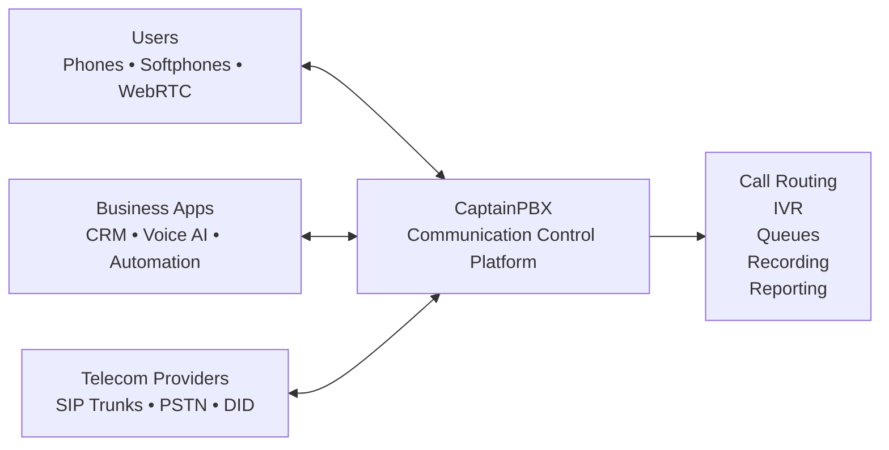
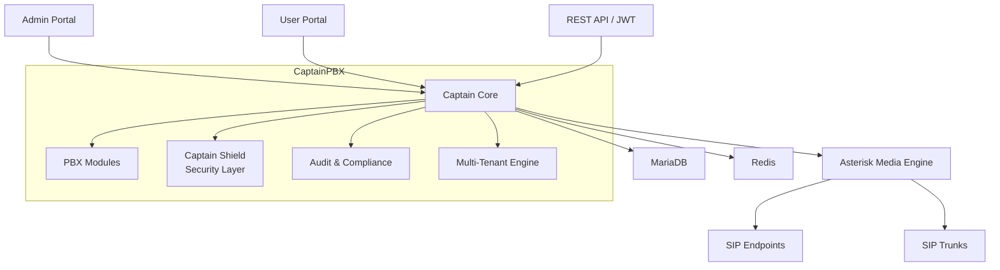
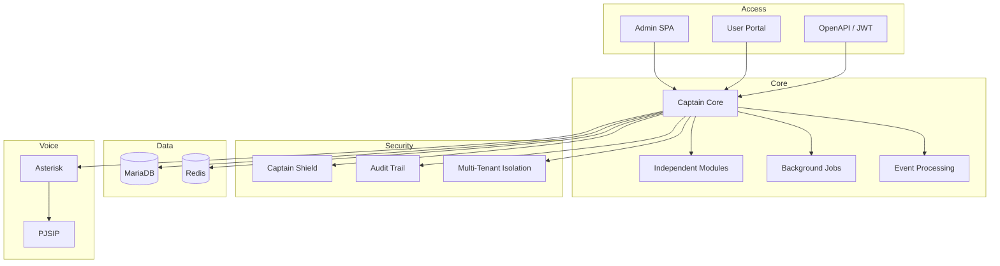

				# Welcome to CaptainPBX

		   ____            _        _       ____  ______  __
		  / ___|__ _ _ __ | |_ __ _(_)_ __ |  _ \| __ ) \/ /
		 | |   / _` | '_ \| __/ _` | | '_ \| |_) |  _ \\  /
		 | |__| (_| | |_) | || (_| | | | | |  __/| |_) /  \
		  \____\__,_| .__/ \__\__,_|_|_| |_|_|   |____/_/\_\
        		    |_|

		        Next-Generation Voice Platform

**CaptainPBX** is a modern, multi-tenant, secure-by-default open-source PBX platform built on a contemporary software stack.

Designed for service providers, enterprises, and developers who need a scalable communications platform that is easy to integrate, secure to operate, and simple to manage.

---

# Why CaptainPBX?

Traditional PBX platforms were designed for a different era.

Today's communication systems must integrate with:

- SIP trunks and telecom providers
- CRM and business applications
- Voice AI platforms
- Contact center solutions
- Automation and workflow engines
- Cloud-native infrastructure

CaptainPBX leverages modern open-source technologies to provide:

✅ Multi-tenant architecture

✅ Secure-by-default deployment

✅ API-first integrations

✅ Modern web administration

✅ Scalable service architecture

✅ Voice AI ready

✅ Developer-friendly ecosystem

✅ Enterprise-grade auditing and access control

---

# Where CaptainPBX Fits

CaptainPBX acts as the communication hub between users, carriers, and business applications.

---

# High-Level Architecture

---

# Internal Components

---

# Key Capabilities

| Area | Features |
|--------|----------|
| Telephony | SIP, PJSIP, Trunks, Extensions |
| Call Handling | IVR, Queues, Ring Groups, Time Conditions |
| Multi-Tenant | Tenant Isolation, Delegated Administration |
| Security | Firewall Controls, Access Policies, Auditing |
| Integration | REST APIs, Webhooks, JWT Authentication |
| Voice AI | AI Agents, Voice Bots, External AI Platforms |
| Operations | Monitoring, Logging, Reporting |
| Scalability | Service-Oriented Architecture |

---

# Built on Modern Open Source Technologies

- Asterisk
- PHP 8+
- MariaDB
- Redis
- Nginx
- JWT Authentication
- OpenAPI
- nftables
- Linux

---

# Vision

CaptainPBX is designed to be the next-generation open-source communication platform that combines traditional telephony, modern APIs, cloud-native architecture, and Voice AI into a single secure platform.
