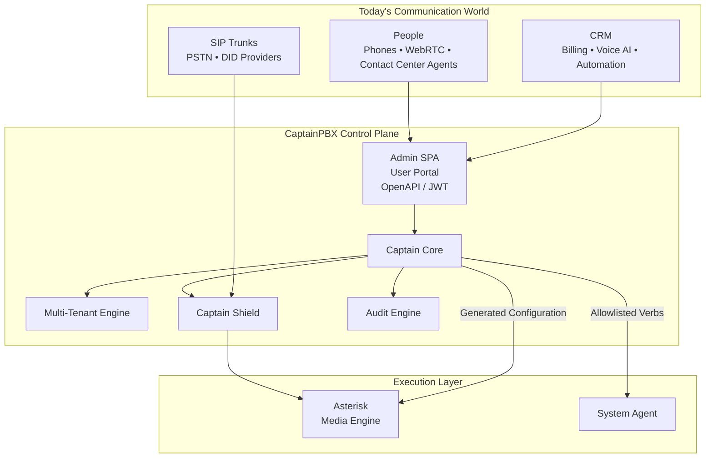
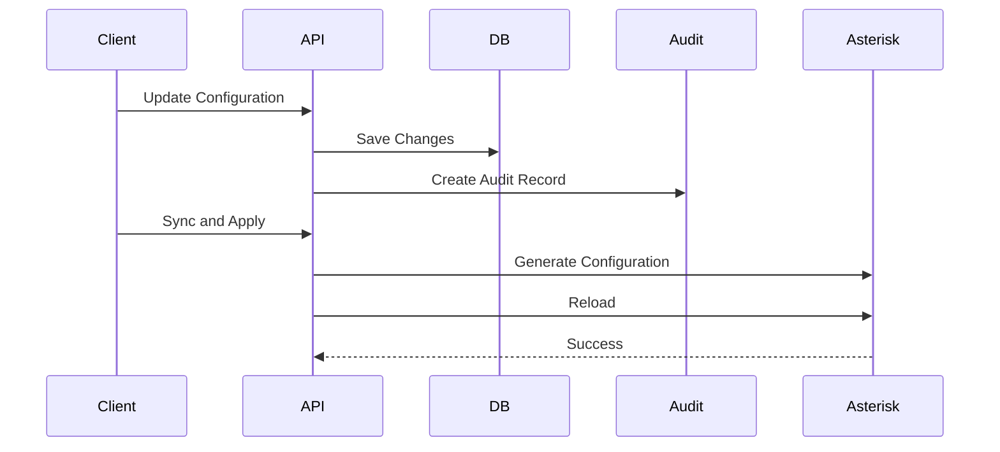

# CaptainPBX Architecture

## Overview

CaptainPBX is a modern voice communications control plane built around five core principles:

* Multi-tenant by design
* Secure by default
* API-first integration
* Strict privilege separation
* Full auditability

CaptainPBX manages platform state, tenancy, security, APIs, and configuration lifecycle.

Asterisk executes calls.

The database is the source of truth.

---

## System Overview



---

## Architectural Philosophy

Traditional PBX platforms often treat Asterisk as both the source of truth and execution engine.

CaptainPBX separates these responsibilities.

### Source Of Truth

All configuration resides in MariaDB.

Examples:

* Extensions
* Queues
* IVRs
* Ring Groups
* Trunks
* Routing Rules
* Security Policies

### Execution

Asterisk receives generated configuration and executes calls.

```text
Admin/API
    │
    ▼
MariaDB
    │
    ▼
CaptainPBX Config Generator
    │
    ▼
*_captain.conf
    │
    ▼
Asterisk Reload
```

Generated configuration is considered output.

Manual modifications are not supported.

---

## Layered Design

```text
┌──────────────────────────┐
│ Admin SPA / User Portal  │
├──────────────────────────┤
│ REST API / JWT           │
├──────────────────────────┤
│ Captain Core             │
├──────────────────────────┤
│ Modules                  │
├──────────────────────────┤
│ Database / Cache         │
├──────────────────────────┤
│ System Agent             │
├──────────────────────────┤
│ Asterisk                 │
└──────────────────────────┘
```

Each layer has a single responsibility.

---

## Core Components

### Captain Core

The Captain Core provides:

* Authentication
* Authorization
* Tenant Context
* Configuration Management
* Event Routing
* Module Framework
* API Services
* Apply Operations

---

### Captain Shield

Captain Shield provides:

* SIP access control
* HTTPS access control
* Firewall integration
* Threat intelligence
* Security policy enforcement

Shield determines who may communicate with the platform.

---

### Audit Engine

Every significant action generates an audit record.

Examples:

* Configuration changes
* Security modifications
* Apply operations
* Administrative actions
* Privileged operations

---

### Multi-Tenant Engine

Tenant isolation is enforced centrally.

The browser never supplies tenant identifiers.

Tenant context is derived from:

* Session identity
* JWT identity
* Administrative scope

This prevents accidental cross-tenant access.

---

## Data Layer

### MariaDB

MariaDB stores:

* Platform configuration
* Tenants
* Extensions
* Queues
* User accounts
* Audit records
* Job schedules

### Redis

Redis provides:

* Queue management
* Event buffering
* Distributed locking
* Session caching

---

## Media Layer

Asterisk is responsible for:

* SIP signaling
* RTP media
* Queue execution
* IVR execution
* Call recording
* Presence

Asterisk does not own platform state.

CaptainPBX generates the runtime configuration consumed by Asterisk.

---

## System Agent

The System Agent is the only root-level component.

Responsibilities include:

* Firewall management
* Timezone changes
* Network operations
* Service management
* Package operations

The agent exposes named verbs over a Unix socket.

Arbitrary shell execution is not supported.

---

## Event Flow



---

## Technology Stack

| Layer            | Technology    |
| ---------------- | ------------- |
| Web              | Nginx         |
| Application      | PHP 8+        |
| Database         | MariaDB       |
| Queue            | Redis         |
| Media            | Asterisk      |
| Security         | nftables      |
| Authentication   | Session + JWT |
| APIs             | OpenAPI       |
| Operating System | Linux         |

---

## Summary

CaptainPBX is a control-plane architecture where:

* MariaDB is the source of truth
* CaptainPBX manages policy and configuration
* Asterisk executes calls
* System Agent performs privileged operations
* Multi-tenancy is enforced centrally
* Security is integrated into the platform design

