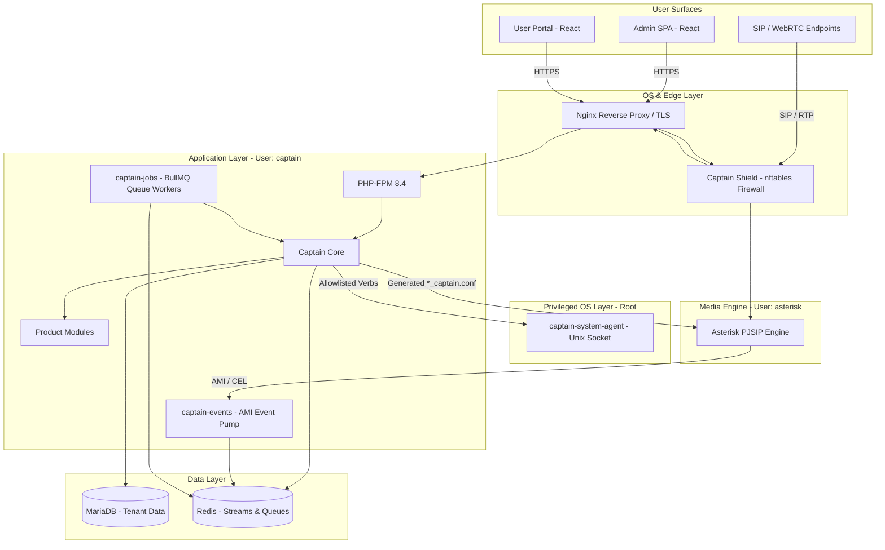
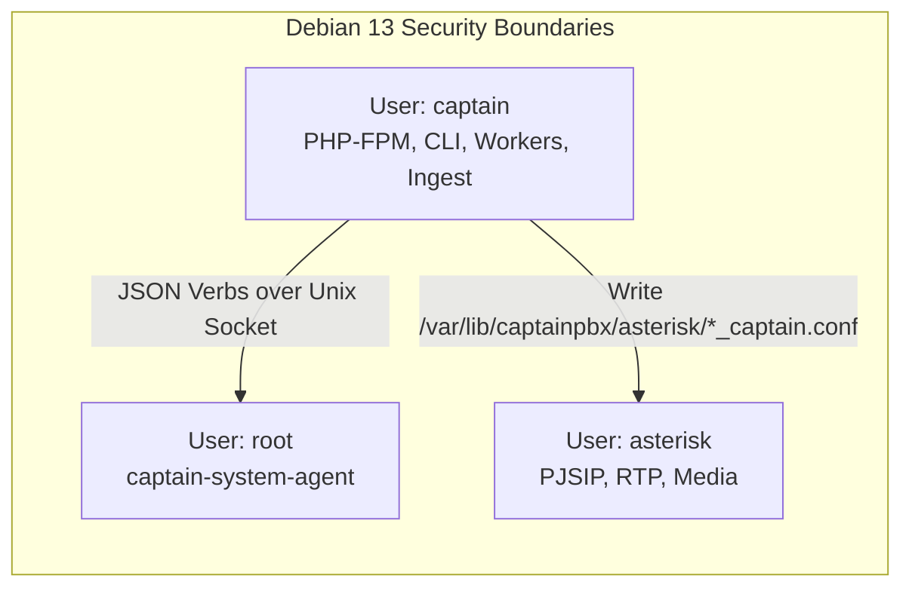
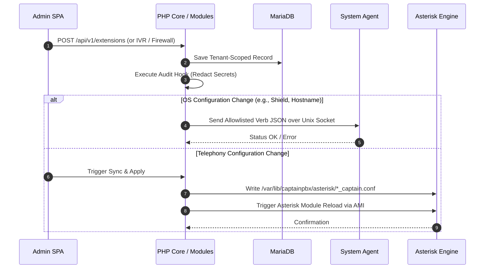
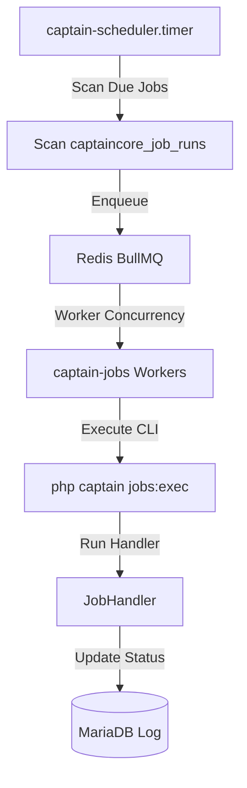
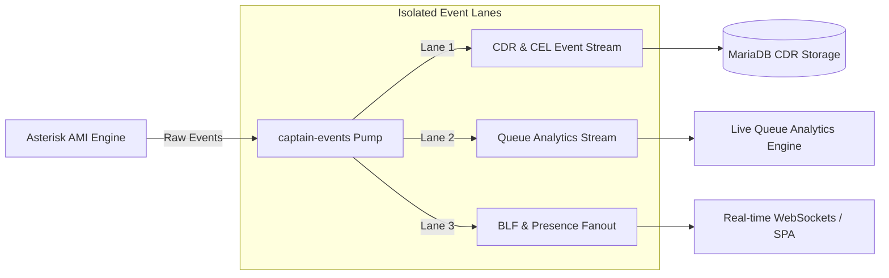
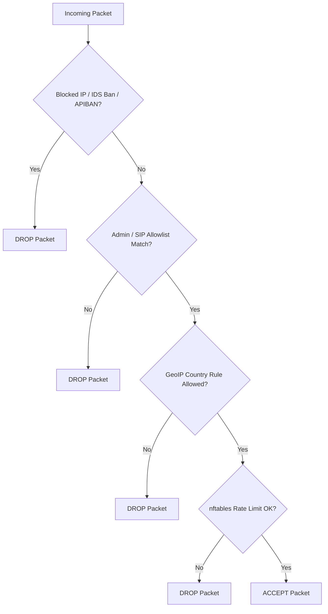
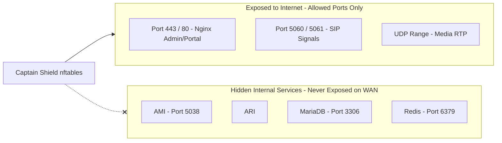

# CaptainPBX System Architecture

**One appliance. Four privilege boundaries. Zero manual configuration files.**

CaptainPBX is a modern telecommunications control plane built on **Debian 13**, separating user management, application logic, media execution, and system privileges into distinct, isolated operational layers.

---

## 1. System Architecture at a Glance

---

## 2. Layered Responsibilities

| Layer | Component | Core Responsibilities | What It Must NOT Do |
| :--- | :--- | :--- | :--- |
| **OS Edge** | Debian 13, Nginx, Captain Shield | SSL termination, default-deny host firewall, rate limiting, GeoIP filtering | Execute application logic or bypass privilege boundaries |
| **Captain Core** | Symfony (PHP 8.4) Platform Services | Tenant Context isolation, auth, audit hooks, job queueing, config compiler | Contain custom UI feature pages or un-audited system calls |
| **Product Modules** | `/usr/src/captainpbx-modules/*` | Module business logic (Shield, Auth, Trust, IVR, Queues), REST APIs, UI components | Edit Asterisk `/etc/asterisk` files or issue `shell_exec` |
| **Media Engine** | Asterisk (PJSIP) | SIP registration, RTP routing, dialplan execution, channel bridging | Act as the source of truth for users, tenants, or extensions |
| **Privileged OS** | `captain-system-agent` | Execute specific system verbs (firewall apply, ACME certs, system time) | Allow unrestricted root shell execution or raw command string execution |

---

## 3. Non-Root Security & Privilege Split

CaptainPBX enforces a strict system-user privilege boundary across the operating system to prevent web application compromises from escalating to OS root access.

* **`captain` user**: Runs PHP-FPM, asynchronous BullMQ workers, the AMI event ingest pump, and CLI commands. `shell_exec`, `exec`, `passthru`, and `system` are disabled in PHP-FPM.
* **`asterisk` user**: Dedicated strictly to media processing, RTP streams, and PJSIP channel execution.
* **`root` user**: Runs only the `captain-system-agent` daemon listening on a local Unix socket. It exposes an **allowlist of named verbs** (e.g., `firewall.apply`, `timezone.set`, `acme.renew`).

---

## 4. How Configuration Changes Become Calls

Application changes made in the Admin SPA are written to MariaDB as tenant-scoped records, compiled into configuration fragments, and applied to Asterisk without raw file editing.

---

## 5. Asynchronous Job Pipeline

Background tasks (such as CDR processing, email notifications, maintenance, and scheduled reports) run asynchronously through **Redis BullMQ** to prevent blocking web requests or media handling.

---

## 6. Real-Time Telephony Event Architecture

Asterisk Manager Interface (AMI) events are ingested by a dedicated event pump service (`captain-events`) and split across isolated Redis stream lanes to eliminate bottlenecking.

---

## 7. Host Security & Network Isolation (Captain Shield)

Captain Shield enforces a default-deny architecture. Internal infrastructure services are completely hidden from the public WAN.

