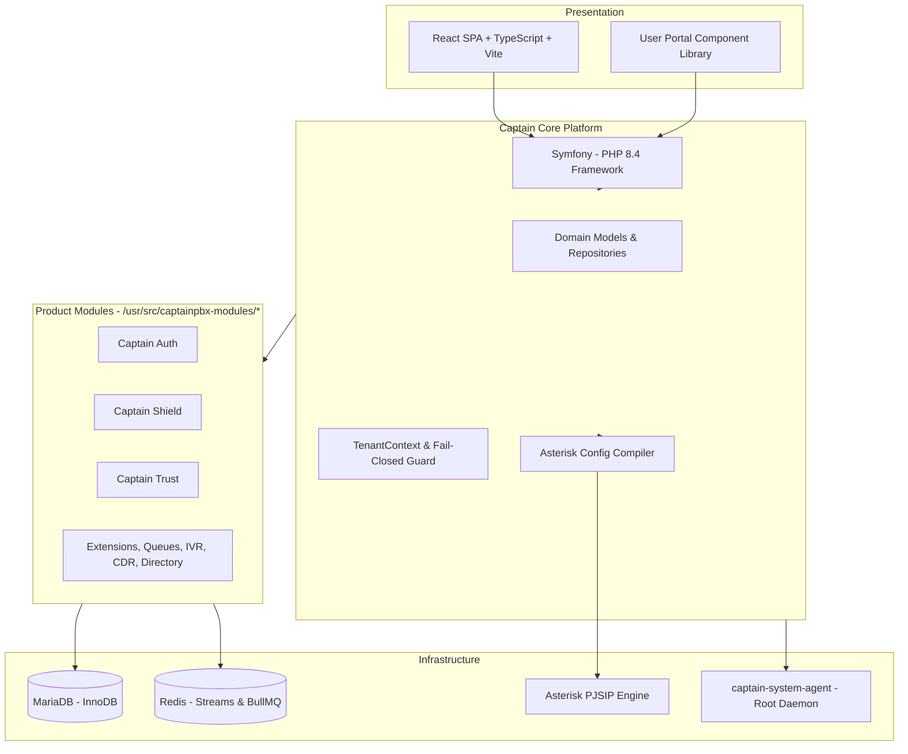
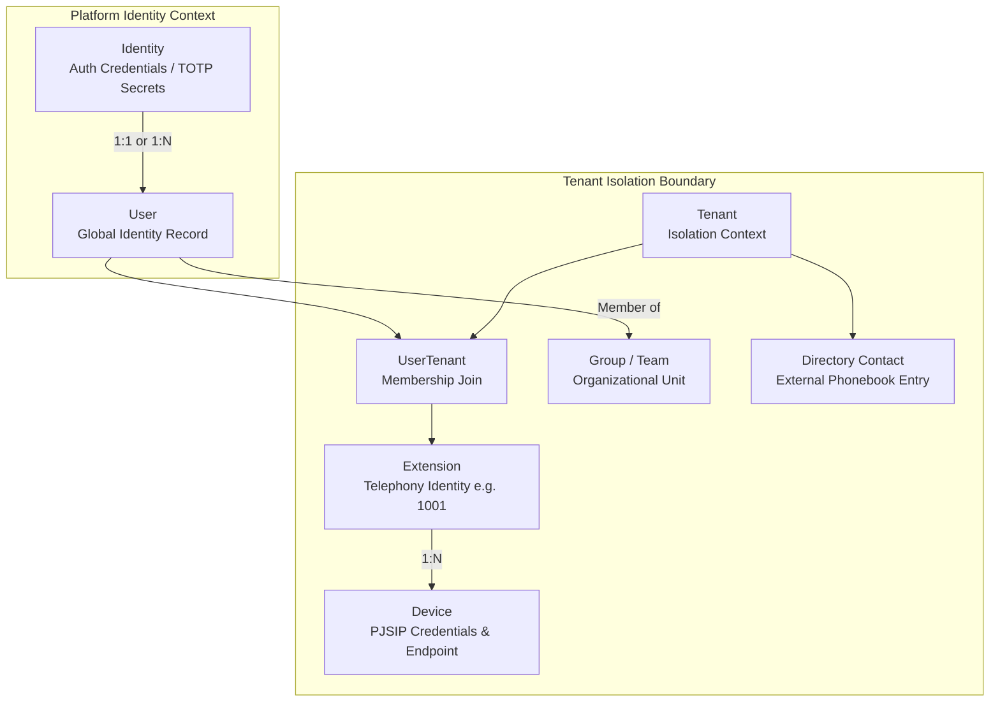
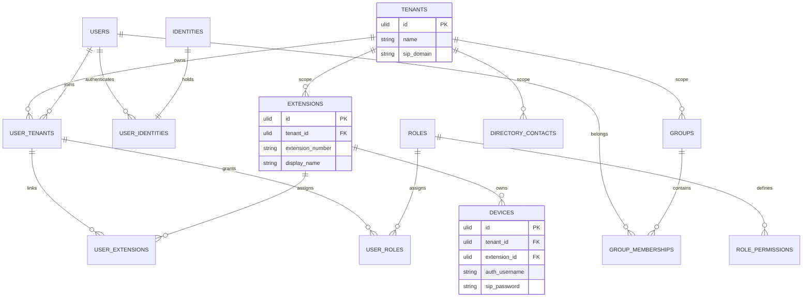
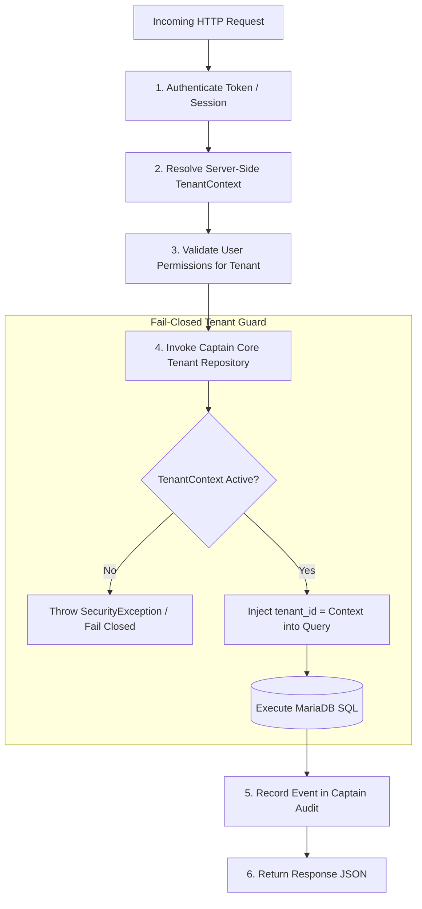
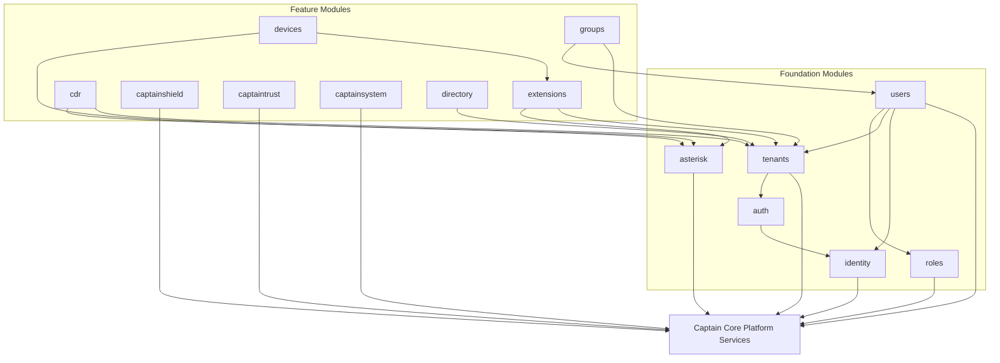
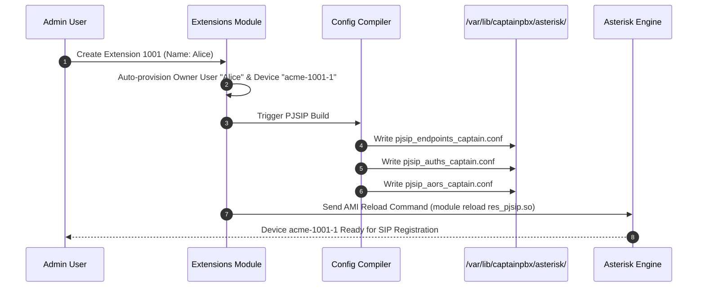

# CaptainPBX Core Architecture & Domain Model

**Product:** CaptainPBX  
**Platform:** Captain Core (Symfony / PHP 8.4)  
**Target Engine:** Asterisk PJSIP  

This document defines the underlying domain model, database boundaries, multi-tenant consistency rules, and module dependencies governing CaptainPBX.

---

## 1. Core Technology Stack

---

## 2. Strict Domain Model

To maintain strict domain boundaries, core concepts are explicitly decoupled into individual entities joined through explicit relationship mapping.

### Key Concept Rules

* **`User` ≠ `Identity`**: `Identity` handles authentication credentials (local, TOTP MFA, future SAML/OIDC). `User` represents the human entity.
* **`User` ≠ `Extension`**: Linked via a 1:1 primary owner relationship (`UserExtension`), but stored in separate tables.
* **`Extension` ≠ `Device`**: Extensions own 0 or more endpoints (`Device`). Each `Device` holds its own unique PJSIP authentication credentials (e.g., `acme-1001-1`, `acme-1001-2`).
* **`Group` ≠ `Role`**: `Group` represents organizational teams (Sales, Support). `Role` represents RBAC authorization bundles.
* **`Tenant` = Hard Isolation Boundary**: Every tenant-owned database table carries `tenant_id`. Cross-tenant queries are blocked at the repository level.

---

## 3. Entity Relationship Diagram (ERD)

---

## 4. Multi-Tenant Data Isolation & Request Lifecycle

Database isolation enforces a **fail-closed model**. Repositories verify `TenantContext` before building SQL queries.

---

## 5. Module System & Dependency Architecture

Product features are isolated into self-contained modules located in `/usr/src/captainpbx-modules/{id}`. Dependencies between modules are strictly acyclic.

---

## 6. Asterisk PJSIP Endpoint Compilation

Creating an Extension automatically generates an owning User and a default SIP Device. The config compiler generates isolated PJSIP blocks for Asterisk.

