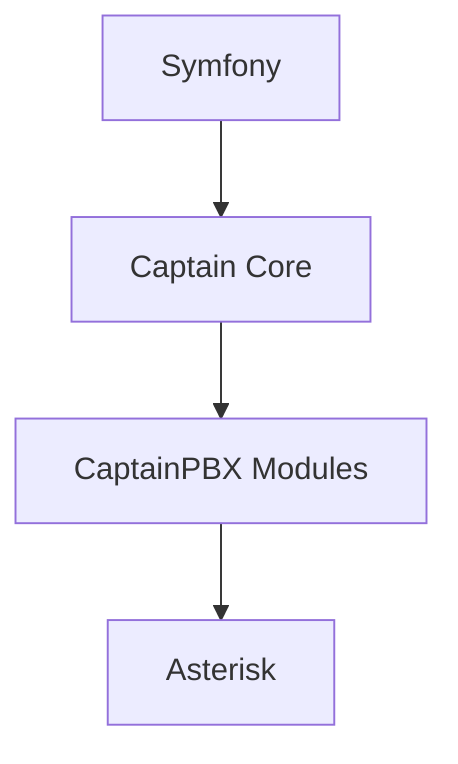

# Captain Core Architecture

## Overview

Captain Core is the reusable platform layer that powers CaptainPBX.

It sits between Symfony and product modules and provides the services required to build a secure, multi-tenant PBX platform.

```text
Symfony
    ↓
Captain Core
    ↓
CaptainPBX Modules
    ↓
Asterisk
```

Captain Core is **not a framework replacement**.

Symfony remains responsible for:

* HTTP routing
* Dependency Injection
* Sessions
* CSRF protection
* Event Dispatching
* Console commands
* Mail delivery
* Cache abstractions

Captain Core provides PBX-specific platform services on top of Symfony.

---

## Responsibilities

Captain Core owns:

### Multi-Tenancy

* TenantContext
* Tenant isolation
* Tenant-aware repositories
* Cross-tenant protection

### Security

* Authentication infrastructure
* Authorization
* Permission evaluation
* Audit framework

### Data Access

* Tenant-aware Records
* Doctrine integration
* Repository abstractions

### Telephony Platform

* Asterisk integration
* AMI integration
* ARI integration
* Dialplan compilation
* Configuration generation

### Platform Services

* Jobs
* Scheduler
* Event processing
* Redis integration
* Secrets management
* Module management

---

## What Captain Core Is Not

Captain Core does not own product features.

Examples:

| Belongs In Core   | Belongs In Modules |
| ----------------- | ------------------ |
| TenantContext     | Extensions         |
| Audit Engine      | Queues             |
| Authorization     | IVR                |
| Records           | Trunks             |
| Dialplan Compiler | Inbound Routes     |
| Event Pipeline    | Voice AI           |
| Module Loader     | Portal Pages       |

If functionality can exist independently as a product capability, it belongs in a module.

---

## Architectural Layers



---

## Captain Core Services

### TenantContext

TenantContext is the foundation of platform isolation.

Responsibilities:

* Resolve tenant identity
* Enforce tenant boundaries
* Prevent cross-tenant access
* Supply tenant information to repositories

Rules:

* TenantContext is mandatory for tenant-owned operations
* Frontend tenant selectors are convenience only
* Browser supplied tenant identifiers are never trusted

---

### Records

Records provide fail-closed repository access.

Responsibilities:

* Automatic tenant scoping
* Repository abstraction
* Safe query patterns
* Consistent data access

Without TenantContext, tenant-owned data cannot be accessed.

This prevents accidental cross-tenant data exposure.

---

### Audit Engine

Every important platform action generates an audit record.

Examples:

* User creation
* Extension creation
* Permission changes
* Apply operations
* Firewall updates
* System Agent requests

Goals:

* Compliance
* Traceability
* Operational visibility

---

### Authorization

Authorization determines what an authenticated identity may perform.

Responsibilities:

* Role evaluation
* Permission evaluation
* Tenant scope enforcement
* Administrative boundary protection

Authorization decisions are centralized.

Modules consume authorization services rather than implementing their own logic.

---

### Module Manager

The Module Manager provides:

* Module discovery
* Module lifecycle management
* Registration
* Dependency validation
* Service loading

Modules are loaded dynamically through the platform.

---

## Asterisk Integration

Captain Core owns all interaction with Asterisk.

Modules never:

* Edit `/etc/asterisk`
* Execute Asterisk shell commands
* Directly manage configuration files

Instead:

```text
Module
    ↓
Captain Core Port
    ↓
Asterisk Manager
    ↓
AMI / ARI
    ↓
Asterisk
```

This provides a consistent integration layer.

---

## Dialplan Manager

The Dialplan Manager compiles configuration from database records.

Inputs:

* Extensions
* Queues
* IVRs
* Routes
* Feature Codes

Outputs:

```text
*_captain.conf
```

Asterisk consumes generated configuration.

The generated files are outputs, not the source of truth.

---

## Event Processing

Captain Core owns the telephony event pipeline.

Sources:

* AMI
* CEL
* CDR
* ARI Events

Pipeline:

```text
Asterisk
    ↓
Event Pump
    ↓
Normalization
    ↓
Redis
    ↓
Consumers
```

Consumers include:

* Reporting
* Queues
* Presence
* Voice AI
* CRM Integrations

---

## Job Framework

Captain Core provides platform scheduling.

Architecture:

```text
Scheduler
    ↓
Redis Queue
    ↓
Workers
    ↓
Job Handlers
```

Responsibilities:

* Scheduling
* Concurrency control
* Timeouts
* Retry policies
* Run history
* Tenant fairness

Modules register JobHandlers.

Core executes them.

---

## System Agent Integration

Captain Core is the only component allowed to communicate with the System Agent.

```text
Module
    ↓
Captain Core
    ↓
System Agent
    ↓
Operating System
```

Modules never:

* shell_exec()
* sudo
* exec()
* system()

All privileged operations are routed through approved platform services.

---

## Module Development Rules

Modules must:

* Consume Captain Core services
* Respect TenantContext
* Use Records repositories
* Generate audit events
* Register permissions
* Register routes through platform APIs

Modules must not:

* Bypass authorization
* Access another tenant directly
* Modify Asterisk files
* Execute operating system commands
* Create alternative tenancy models

---

## Core Runtime Services

### Web Layer

* Nginx
* PHP-FPM

### Data Layer

* MariaDB
* Redis

### Background Services

* captain-worker
* captain-scheduler
* captain-asterisk-events

### Privileged Services

* captain-system-agent

### Media Services

* Asterisk

---

## Design Goals

Captain Core exists to provide:

1. Multi-tenant isolation
2. Security by default
3. Reusable PBX services
4. Consistent module development
5. Safe Asterisk integration
6. Operational observability
7. Long-term maintainability

Product functionality belongs in modules.

Platform functionality belongs in Captain Core.

