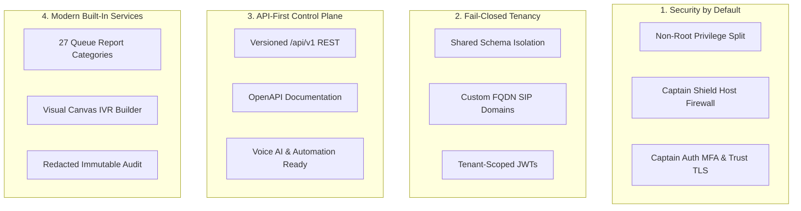
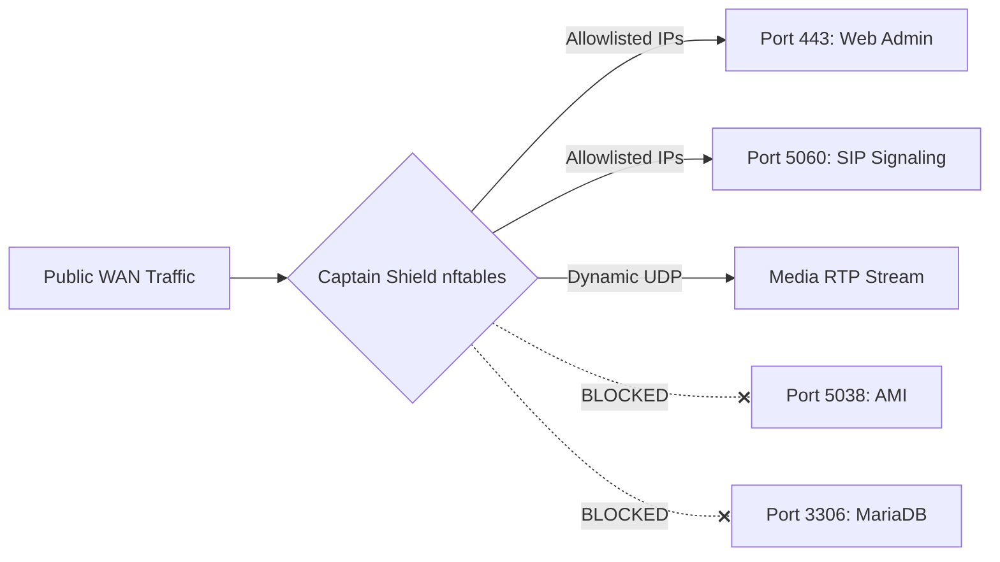
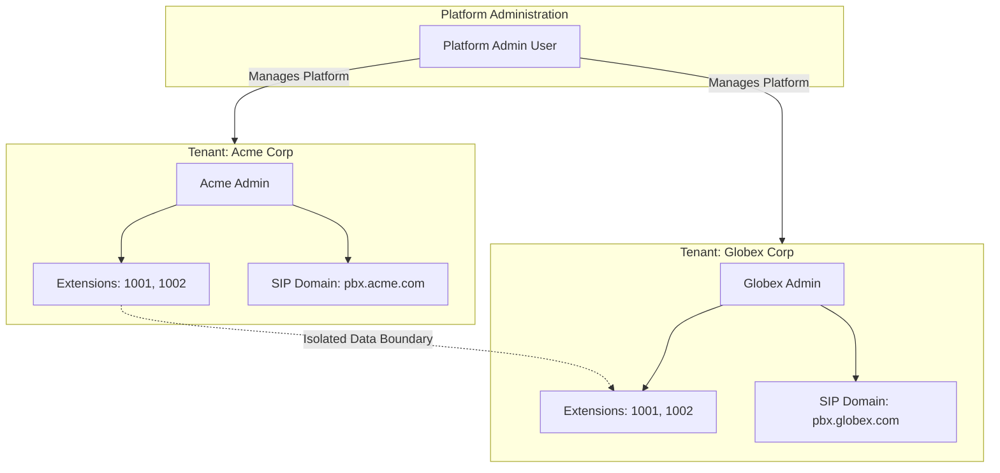
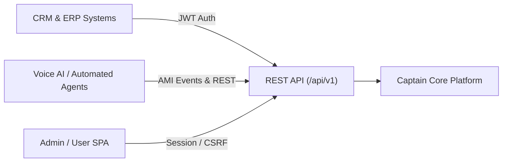
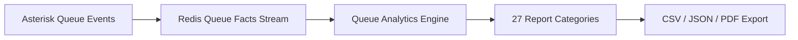
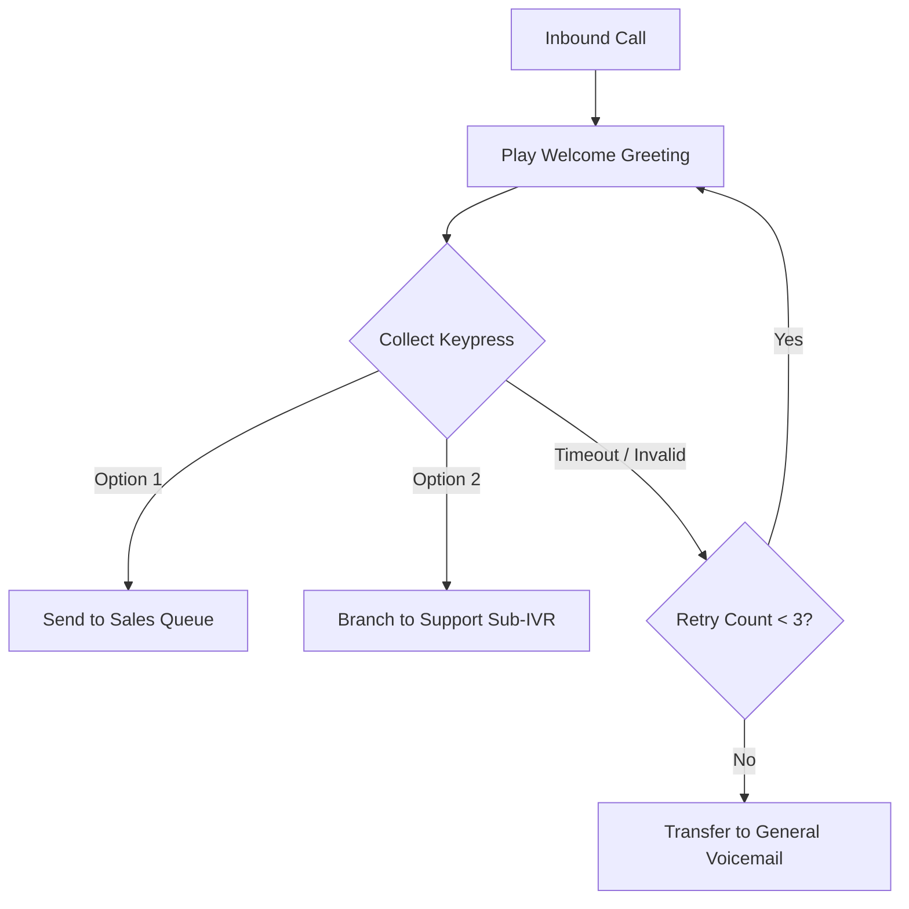

# Key Design Principles & Built-in Services

**Why CaptainPBX is built for modern telecommunications operators, MSPs, and open-source developers.**

CaptainPBX replaces legacy PBX systems—which were traditionally built as web interface wrappers around configuration files—with a **modular, API-first control plane** designed for high security, multi-tenancy, and automation.

---

## 1. Architectural Philosophy: The Four Pillars

---

## 2. Pillar 1: Built-in Security Architecture

### A. Captain Shield (Host Protection)
* **Default Deny**: Administrative ports (443, 22) and SIP signaling (5060/5061) are closed by default until explicitly allowlisted by IP, CIDR, or FQDN.
* **Intrusion Detection System (IDS)**: Automatically bans IPs attempting brute-force logins across HTTP, SIP REGISTER, or SSH.
* **GeoIP & Threat Feeds**: Filter incoming traffic by country (DB-IP Lite) and ingest community threat intelligence (APIBAN).
* **WAN Hiding**: Internal infrastructure ports (AMI 5038, MariaDB 3306, Redis 6379) are strictly bound to internal interfaces and never exposed to the WAN.

### B. Captain Auth (Multi-Factor Authentication)
* Supports **TOTP MFA** and single-use backup recovery codes for web logins.
* Enforcement policy can be set per tenant: **Off**, **Optional**, or **Required**.

### C. Captain Trust (Automated TLS Management)
* Manages local certificates, uploaded PEM files, and automated **ACME HTTP-01 renewals** (Let's Encrypt).
* Automatically provisions and deploys certificates to Nginx and PJSIP without manual shell administration.

### D. Captain Audit (Security Trail)
* Intercepts all database modifications at the repository layer.
* Automatically redacts passwords, SIP secrets, and API tokens before persisting audit entries.

### E. Captain Bridge (OS Service Management)
* Exposes safe operating system management (timezones, network configuration, updates) via allowlisted JSON verbs sent to `captain-system-agent`.

---

## 3. Pillar 2: Fail-Closed Multi-Tenancy

CaptainPBX allows multi-tenant operation on a single shared media engine without risking cross-tenant data leaks.

* **Data Isolation**: `tenant_id` from client browsers is ignored. The active tenant is resolved server-side during authentication.
* **Overlapping Namespaces**: Extensions (e.g., `1001`) are scoped to individual tenants, allowing distinct tenants to share identical extension numbering schemes.
* **SIP Domains**: Each tenant registers endpoints using its dedicated `sip_domain`.

---

## 4. Pillar 3: Modular, Developer-First Architecture

* **Unified API Catalog**: Every action available in the UI is backed by versioned REST endpoints (`/api/v1/`) documented with OpenAPI specifications.
* **Automation Ready**: Integrators can programmatically manage extensions, routes, and call handling, making CaptainPBX a solid base for **Voice AI agents, CRM call automation, and custom PBX workflows**.
* **Decoupled Frontend**: Built as a React Single Page Application (SPA) communicating exclusively via JSON APIs.

---

## 5. Pillar 4: Built-in Advanced Capabilities

### A. Queue Analytics & Reporting
* Features **27 distinct queue report categories**, including operational metrics, SLA calculations, ASA (Average Speed of Answer) trends, agent handle times, and heatmaps.
* Filters out short hangups (e.g., under 5 seconds) to ensure accurate SLA tracking.
* Offers instant export to **CSV, JSON, and PDF**.

### B. Modern Visual IVR Builder
* Offers both a **Visual Canvas Interface** and a **Form-based Editor** built on a single graph model.
* Supports multi-level menu branching, digit routing, direct extension dialing, holiday schedules, and automated destination routing.

---

## 6. Migration Matrix for Open Source Operators

| Feature | Legacy PBX Software | CaptainPBX |
| :--- | :--- | :--- |
| **Architecture** | Web GUI wrapper over Asterisk configuration files | Decoupled control plane with a Symfony/React core |
| **System Security** | Web server frequently runs as `root` with `sudo` access | Non-root `captain` user with a constrained `captain-system-agent` |
| **Host Protection** | Manual iptables scripts or external firewalls | Built-in nftables firewall (Captain Shield) with GeoIP and IDS |
| **Multi-Tenancy** | Requires separate physical or virtual instances | Enforced multi-tenant isolation on a single media engine |
| **API Support** | Custom PHP scripts or unversioned endpoints | Fully versioned `/api/v1/` REST catalog with OpenAPI specifications |
| **Queue Reporting** | Basic third-party addon scripts | 27 built-in report categories with SLA math and PDF exports |
| **TLS Automation** | Manual Certbot/Let's Encrypt command-line setups | Automated ACME management (Captain Trust) via web UI |
